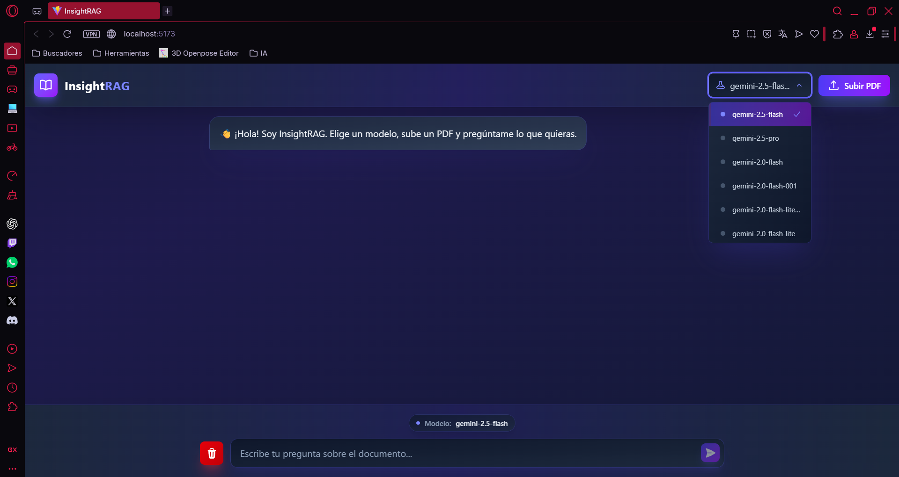
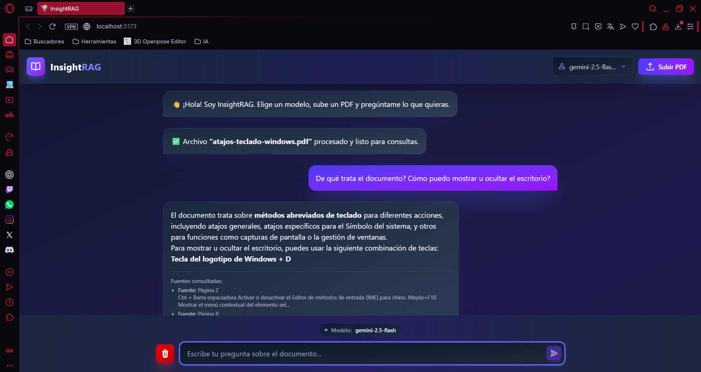

# 🧠 InsightRAG: Intelligent Document Intelligence System

[](https://www.python.org/)
[](https://fastapi.tiangolo.com/)
[](https://react.dev/)
[](https://opensource.org/licenses/MIT)

InsightRAG es un sistema de Generación Aumentada por Recuperación (RAG) diseñado para transformar documentos PDF estáticos en una base de conocimiento interactiva. Combina **embeddings locales** (privacidad/coste) con **LLMs (Google Gemini)** para sintetizar respuestas con trazabilidad.

## 🚀 Key Features
- **Hybrid RAG Pipeline:** ingesta PDF → chunking → embeddings locales → ChromaDB → recuperación → respuesta con Gemini.
- **Dynamic Model Selection:** lista modelos disponibles desde el proveedor y permite elegir en UI.
- **Vector Persistence:** persistencia local en ChromaDB para iterar rápido.
- **Sources / Traceability:** devuelve evidencias con metadatos (página) + snippet.
- **Professional UI:** chat moderno con selección de modelo y carga de documentos.

## 🏗️ Architecture

La documentación técnica está en la carpeta `docs/`:
- [docs/ARCHITECTURE.md](docs/ARCHITECTURE.md): flujo completo PDF → vectores → RAG (incluye diagramas Mermaid).
- [docs/API_GUIDE.md](docs/API_GUIDE.md): contrato API, errores y notas operativas (incl. 429).
- [docs/DECISIONS.md](docs/DECISIONS.md): justificación de decisiones (embeddings locales, chunking, persistencia, etc.).

## 🛠️ Tech Stack

| Component | Technology |
|---|---|
| Frontend | React + Vite + Axios + Tailwind |
| Backend | FastAPI + LangChain |
| Vector DB | ChromaDB |
| Embeddings | HuggingFace (local: `sentence-transformers/all-MiniLM-L6-v2`) |
| LLM | Google Gemini (via `langchain-google-genai`) |

## ⚙️ Installation & Setup

### 1) Backend

```bash
cd backend
pip install -r requirements.txt
```

Crea tu `.env` (puedes copiar el ejemplo):

```bash
copy .env.example .env
```

Añade tu `GOOGLE_API_KEY` en `backend/.env`.

Arranque:

```bash
uvicorn src.main:app --reload
```

API (dev): `http://127.0.0.1:8000`
Swagger: `http://127.0.0.1:8000/docs`

### 2) Frontend

```bash
cd frontend
npm install
```

Configura la URL del backend con variables de entorno (Vite):
- `frontend/.env` (ya incluido en este repo para dev local)
- ejemplo: `frontend/.env.example`

```bash
npm run dev
```

UI (dev): `http://localhost:5173`

## 📸 Screenshots

### 1) Vista principal (UI)

Interfaz principal del chat, con **selector de modelo** y **carga de documentos PDF** para iniciar la ingesta.



### 2) Respuesta con trazabilidad (RAG)

Ejemplo de pregunta y respuesta generada, incluyendo **fuentes/evidencias** con metadatos (página) y un snippet del contenido recuperado.



## 🧪 API Contract (Quick Reference)

- `GET /models` → lista modelos
- `POST /upload` → ingiere un PDF
- `POST /ask` → `{ query, model_name }` → `{ answer, sources: [{ page, snippet }] }`
- `POST /reset` → resetea vector DB

## 🗺️ Roadmap (Engineering-grade)

- Rate limiting server-side y backoff con jitter para 429.
- Streaming de tokens (SSE/WebSocket) para UX.
- Multi-document / multi-user (índices por sesión/usuario).
- Evaluación: dataset + métricas (hit-rate, faithfulness).
