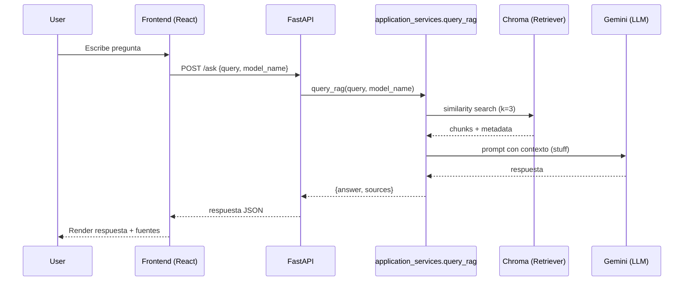

# Architecture — InsightRAG

Este documento describe la arquitectura del sistema InsightRAG y, sobre todo, el flujo completo de datos: **PDF → chunks → embeddings → ChromaDB → recuperación → respuesta del LLM**.

## System Overview

InsightRAG es un sistema RAG (Retrieval-Augmented Generation) con:

- **Frontend** (React + Vite): carga PDFs, selecciona modelo, chat y tema claro/oscuro persistente.
- **Backend** (FastAPI + LangChain): ingesta, chunking, embeddings, búsqueda vectorial, RAG y separación por capas.
- **Vector DB** (Chroma persistente): almacena embeddings y metadatos.
- **Embeddings locales** (`sentence-transformers/all-MiniLM-L6-v2`): privacidad/coste y menor dependencia externa.
- **LLM** (Google Gemini via `langchain-google-genai`): genera la respuesta final usando contexto recuperado.
- **Theme System** (frontend): tokens semánticos, superficies tipo macOS y toggle persistente.

## Componentes

- **API Layer**
  - `src/main.py`: instancia FastAPI, lifespan y handlers.
  - `src/api/routes.py`: `GET /models`, `POST /upload`, `POST /ask`, `POST /reset`.
  - `src/api/dependencies.py`: auth y providers.

- **Application Layer**
  - `src/application_services.py`: `process_pdf`, `query_rag`, `reset_vector_database`, `list_available_models`.

- **Domain Layer**
  - `src/domain/exceptions.py`: `AppError`, `ValidationError`, `ProcessingError`, `InfrastructureError`.

- **Compatibility Bridge**
  - `src/services.py`: reexporta la nueva capa para mantener imports existentes.

## Data Flow (PDF → Vector DB)

```mermaid
flowchart LR
  A[Browser
FileUploader] -->|POST /upload (multipart)| B[FastAPI
upload_pdf]
  B --> C[application_services.process_pdf]
  C --> D[Temp file
backend/temp_files]
  C --> E[PyPDFLoader
page-level docs]
  E --> F[RecursiveCharacterTextSplitter
chunks 1000/overlap 200]
  F --> G[HuggingFaceEmbeddings
all-MiniLM-L6-v2]
  G --> H[Chroma
persist_directory=backend/chroma_db]
  H --> I[Persisted vectors
+ metadata (e.g., page)]
```

### Detalles operativos de ingesta

1. El frontend manda el PDF con `multipart/form-data`.
2. `src/api/routes.py` valida MIME, tamaño y auth si corresponde.
3. `src/application_services.py` escribe el archivo en `TEMP_FOLDER`.
4. `PyPDFLoader` produce documentos por página (incluye metadatos como `page`).
5. `RecursiveCharacterTextSplitter` divide en chunks con solape.
6. Se calculan embeddings localmente.
7. Chroma persiste en disco, permitiendo reinicios sin perder el índice.

## Query Flow (Pregunta → Respuesta)



## Storage & Persistence

- Chroma usa `persist_directory=./chroma_db` (relativo al backend). Esto permite:
  - reiniciar el backend sin reindexar,
  - operar como MVP sin dependencias externas.

## Frontend UI Architecture

La UI se reorganizó para reducir deuda técnica visual:

- `src/context/ThemeContext.jsx`: tema global, persistencia y sincronía con el sistema.
- `src/components/ui/Button.jsx`: primitiva reutilizable para acciones.
- `src/components/Header.jsx`: cabecera tipo macOS con toggle de tema.
- `src/components/InputArea.jsx`: composición del input de usuario y acción de reset.
- `src/components/ResetConfirmModal.jsx`: modal controlado y renderizado en portal.

El objetivo es que los componentes de presentación consuman tokens y no colores hardcoded.

## Security & Privacy Notes

- Los **embeddings son locales**: el texto del documento no se envía a un servicio externo para vectorización.
- Aun así, el texto recuperado (chunks) **sí se envía al LLM** para generar la respuesta.
- En producción se recomienda:
  - restringir CORS,
  - autenticar endpoints,
  - limitar tamaño de PDF y tipo MIME,
  - auditar/anonimizar datos sensibles si procede.

## Design Principles

- Superficies neutras y jerarquía visual suave, estilo macOS.
- Modo claro/oscuro con tokens semánticos, no colores aislados en JSX.
- Componentes pequeños y composables.
- Feedback de interacción claro, sin efectos visuales invasivos.

## Error Handling (High-Level)

- `400`: archivo no PDF.
- `500`: errores inesperados (lectura PDF, embeddings, vector DB, LLM).
- `429` (posible): rate limit del proveedor LLM; ver [docs/API_GUIDE.md](API_GUIDE.md).

## Scalability Notes (Qué cambiaría en producción)

- Externalizar Chroma a un servicio (o migrar a un vector DB gestionado).
- Jobs asíncronos para ingesta (Celery/RQ) y colas.
- Cache de preguntas frecuentes.
- Observabilidad: métricas, traces, logs estructurados.
