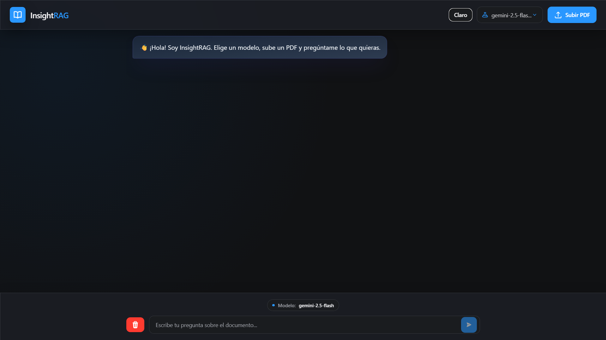
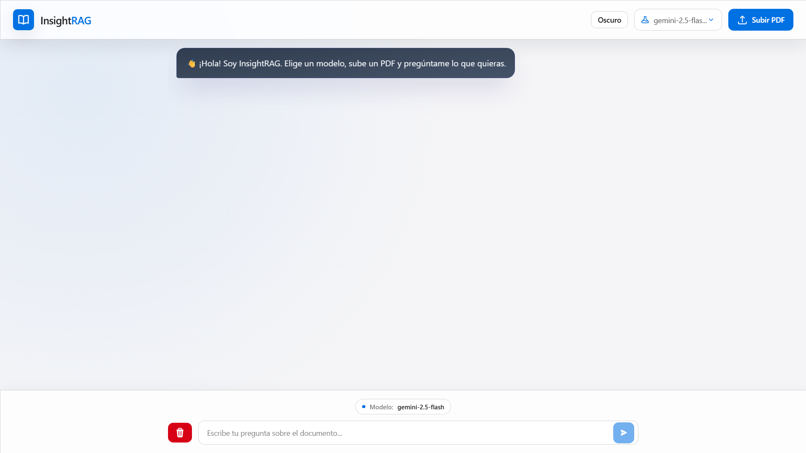

# InsightRAG Frontend

Interfaz React para InsightRAG, reconstruida con una estética más limpia tipo macOS, componentes pequeños y tema claro/oscuro persistente.

## Highlights

- Tema global con persistencia en `localStorage`.
- Tokens visuales semánticos para superficies, texto y acentos.
- Componentes reutilizables para botones y controles.
- Modal de confirmación renderizado en portal para evitar romper el layout.
- UI responsive para escritorio y móvil.

## Screenshots

### Home - dark mode



### Home - light mode



### Response with sources


## Development

```bash
npm install
npm run dev
```

## Quality

```bash
npm run lint
npm run test -- --run
```
